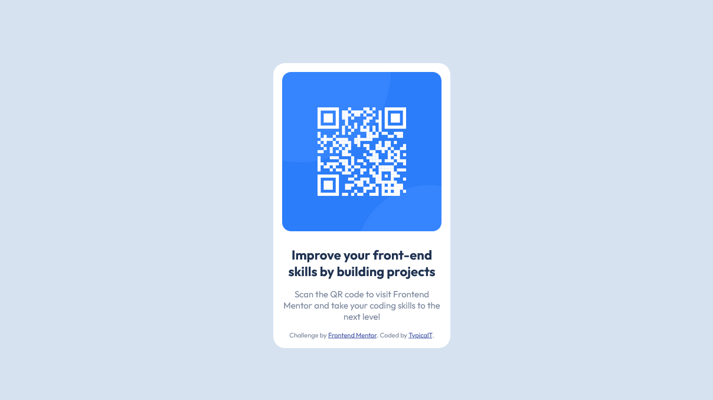

# Frontend Mentor - QR code component solution

This is a solution to the [QR code component challenge on Frontend Mentor](https://www.frontendmentor.io/challenges/qr-code-component-iux_sIO_H). Frontend Mentor challenges help you improve your coding skills by building realistic projects.

## Table of contents

-   [Overview](#overview)
    -   [Screenshot](#screenshot)
    -   [Links](#links)
-   [My process](#my-process)
    -   [Built with](#built-with)
    -   [What I learned](#what-i-learned)
    -   [Useful resources](#useful-resources)
-   [Author](#author)

**Note: Delete this note and update the table of contents based on what sections you keep.**

## Overview

### Screenshot



### Links

-   Solution URL: [Add solution URL here](https://your-solution-url.com)
-   Live Site URL: [Click Here](https://imtypicalt.github.io/frontend-mentor-qr-code-component/)

## My process

### Built with

-   HTML5
-   CSS
-   Flexbox

### What I learned

Most of this project took place within the stylesheet. There I was able to figure out how to center the flexbox on the page, and center the elements inside of it. Getting the opportunity to figure out how to make rounded corners was pretty fun too, it makes the finished project look much mor polished.

```css
.box {
    background-color: hsl(0, 0%, 100%);
    width: 300px;
    padding: 15px;
    border-radius: 20px;
    margin: auto;
}
```

### Useful resources

-   [W3Schools](https://www.w3schools.com/css/) - This was a big help and answered many questions I had along the way. The interactive examples were a huge help.

## Author

-   GitHub - [ Typical Taylor ](https://github.com/imTypicalT)
-   Frontend Mentor - [@imTypicalT](https://www.frontendmentor.io/profile/imTypicalT)
-   Twitter - [@imTypicalT](https://twitter.com/imTypicalT)
